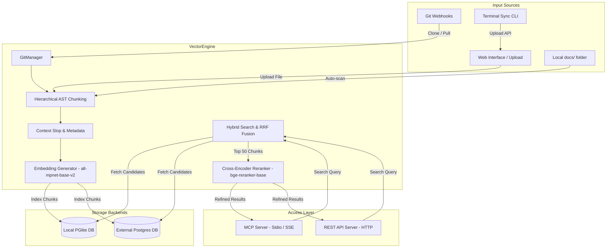

# Architecture Overview

`raglike-md` is a high-performance local semantic document retrieval system that indexes markdown files and provides interfaces via both the Model Context Protocol (MCP) and a standard HTTP API.

---

## 🏛 Directory Architecture

`raglike-md` utilizes specific directories for managing raw files and persistence:

*   **`docs/`**: Standard workspace documentation. These are typically local files committed to version control and are scanned on startup.
*   **`.docs-ingested/`**: Documents uploaded directly via the REST API or the frontend web dashboard.
*   **`.repos/`**: Remote git repositories cloned or pulled via webhook events.
*   **`.db/`**: Persistent storage directory for the local **PGlite** WASM-based PostgreSQL instance.
*   **`.logs/`**: Directory where persistent application logs (`app.log`) are stored.

---

## ⚙️ Core Components

### 1. Vector Engine ([src/engine.ts](file:///home/andrecrjr/Documents/dev/mcps/raglike-md/src/engine.ts))
The heart of the application. It handles database connections, document ingestion, AST parsing, embedding generation, and hybrid retrieval:
*   **Dual DB Layer**: Seamlessly switches between embedded **PGlite** (with disk persistence in `./.db`) and **External Postgres** (using `POSTGRES_URL`).
*   **Smart AST Chunking**: Parses Markdown using `mdast` to extract structured sections. It divides large sections into paragraphs, keeping code blocks bound to their preceding context.
*   **Context Slop**: Prepends/appends neighboring sentences to boundary chunks to enrich contextual scope.
*   **Feature Extraction**: Generates 768-dimensional normalized embeddings locally via `@xenova/transformers` using the `all-mpnet-base-v2` model.
*   **4-Way Reciprocal Rank Fusion (RRF)**: Merges scores from semantic search, English text search (stemmed), Simple text search (literal/technical), and Heading boost matching.
*   **Cross-Encoder Reranking**: Utilizes `Xenova/bge-reranker-base` to rerank the top candidates to ensure ultra-high relevance.

### 2. MCP Server ([src/mcp.ts](file:///home/andrecrjr/Documents/dev/mcps/raglike-md/src/mcp.ts))
Implements the [Model Context Protocol](https://modelcontextprotocol.io/) to expose search capabilities to AI tools:
*   `semantic_markdown_search`: Returns granular document chunks matching a query. Supports `repository` filtering, `hybrid` mode toggle, and `rerank` activation.
*   `read_chunk_neighbors`: Expands the local search result by fetching the previous/next logical chunks in the document.
*   `get_full_document`: Fetches the entire raw file for full-context analysis.

### 3. HTTP API Server ([src/api.ts](file:///home/andrecrjr/Documents/dev/mcps/raglike-md/src/api.ts))
Exposes REST endpoints and serves a local web client:
*   Includes a stateful Server-Sent Events (SSE) `/mcp` transport.
*   Enforces optional Bearer token security.
*   Handles multi-multipart file uploads and direct chunk deletions.
*   Synchronizes git pushes from GitLab/GitHub via HMAC/Token signature verified webhooks.

### 4. Git Manager ([src/git.ts](file:///home/andrecrjr/Documents/dev/mcps/raglike-md/src/git.ts))
Integrates with the local git binary to clone or pull git repositories when webhook events are received, subsequently indexing all contained `.md` files under a dedicated `repository_id` scope.
