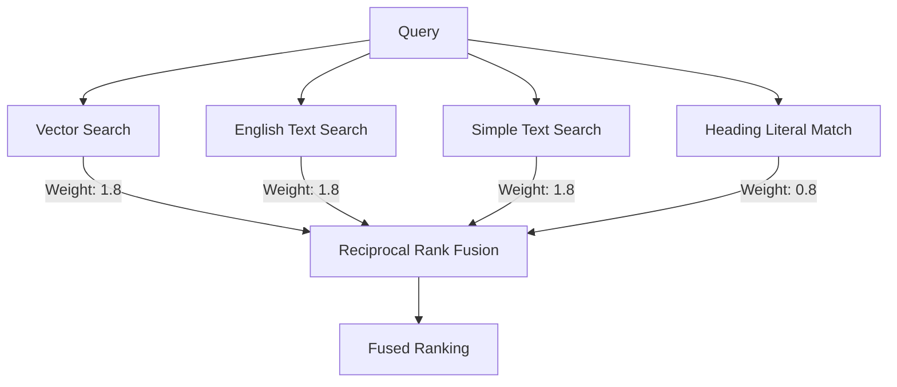

# Vector Engine Internals

The `VectorEngine` class ([src/engine.ts](../../src/engine.ts)) manages document ingestion, structured chunking, vector embedding, and hybrid search retrieval.

---

## 🏛 Dual Database Architecture

The engine dynamically selects its backend based on availability:
1.  **External Postgres**: If `POSTGRES_URL` is set, the engine uses the `postgres` driver to connect.
2.  **Local PGlite**: If no URL is provided, it initiates an embedded, WASM-compiled PGlite instance storing data locally in the `./raglike_db` or `.db/` directory.
3.  **HNSW Index**: On initialization, the engine creates an HNSW index on the `embedding` column using cosine distance to ensure sub-second search times. It configures the session-level parameters (`hnsw.ef_search = 100`) to maximize recall.

---

## ✂️ Hierarchical Markdown AST Chunking

Traditional chunking techniques split text based on a fixed character count, frequently splitting code snippets or losing structural context. `raglike-md` resolves this by parsing documents into an **Abstract Syntax Tree (AST)** using `mdast`:

1.  **Section boundaries**: The engine splits documents strictly by Markdown headers (`#`, `##`, `###`), working directly with the AST nodes array (`Content[]`) rather than raw string representations.
2.  **Code-Block AST Preservation**: Code blocks are processed as intact `code` AST nodes. This preserves formatting and prevents them from being split, even if they contain empty lines (double newlines).
3.  **Context Bundling**: Code blocks are always force-bundled with their preceding explanatory block to ensure context. They are explicitly exempted from recursive character-based splitting (`RecursiveCharacterTextSplitter`), keeping the code snippet and its explanation together in a single chunk.
4.  **Sliding Window**: Inside each section, non-code text blocks are chunked into windows of ~1000 characters with a 250-character overlap, splitting at natural text breaks when possible.
5.  **Noise Filtering**: Any chunk containing fewer than 20 characters is discarded to prevent indexing short, non-informational strings.
6.  **Hierarchical Breadcrumbs**: Every chunk is prefixed with its full heading ancestry path (e.g. `H1 > H2 > H3`). This ensures that even deeply nested content maintains structural context during isolated retrieval.
7.  **Context Slop (Boundary Enrichment)**: To bridge sections, "Context Slop" is added:
    *   The **last sentence** of the previous section is prepended to the first chunk of the current section.
    *   The **first sentence** of the next section is appended to the last chunk of the current section.

---

## 🔍 Search Pipelines

`raglike-md` supports two search strategies: Pure Vector Search and 4-way Hybrid Search.

### 1. Pure Vector Search (Default)
Translates the query string into a 768-dimensional normalized embedding using **Xenova/all-mpnet-base-v2** and queries the HNSW index using cosine similarity (via the negative inner product operator `<#>`).

### 2. Hybrid Search (RRF)
When `hybrid: true` is requested, the engine executes four distinct searches and fuses them using **Reciprocal Rank Fusion (RRF)**:

*   **Vector Search (Weight: 1.8)**: Concept-based similarity search using the HNSW index (high priority).
*   **English Text Search (Weight: 1.8)**: Stemmed keyword matching using the Postgres `english` dictionary. Configured with custom `ts_rank_cd` weights (`'{0.1, 0.2, 1.0, 0.6}'`) to prioritize body content matches over headings.
*   **Simple Text Search (Weight: 1.8)**: Unstemmed, literal term matching using the `simple` dictionary. Prioritizes exact technical terms, functions, or variable names, configured with custom `ts_rank_cd` weights to favor body content.
*   **Heading Literal Match (Weight: 0.8)**: Lowered search priority for matching words inside document headings, allowing body text matches to prevail.
*   **Technical Boost**: If the query includes common technical terms or syntax patterns (e.g., `camelCase`, `dot.notation()`, `functionCall()`, `.extensions`), a **1.2x score multiplier** is applied to code block chunks.

---

## 🏷 Multi-Repository Isolation

For multi-project environments, the engine supports logical isolation:
*   **Tagging**: When indexing via Git webhooks or specifying repo scopes, chunks are tagged with a `repository_id` column.
*   **Scoping**: If a client provides a `repository` parameter during search, a hard SQL filter (`WHERE repository_id = $ID`) is enforced during Stage 1 retrieval, completely isolating results.

---

## ⚡ Stage 2: Cross-Encoder Reranking

When `rerank: true` is enabled, candidate chunks are processed along with the query through a secondary **Cross-Encoder** model (**Xenova/bge-reranker-base**).

### Performance & Latency Trade-offs:
Reranking significantly improves accuracy but increases latency (often by 5x-10x) because:
*   **Inference Complexity**: Bi-encoders encode queries and documents independently. Cross-encoders require a joint forward pass of the transformer model for each query-document pair.
*   **Candidate Expansion**: The engine automatically expands the initial candidate list to **50 chunks** (or `limit * 10`) to ensure high recall for the reranking step.
*   **CPU Limitation**: In local environments, running 50 transformer passes sequentially on a CPU is computationally expensive.
*   **Best Practice**: Enable reranking for high-precision, question-answering tasks and disable it for speed-critical search auto-completes.
