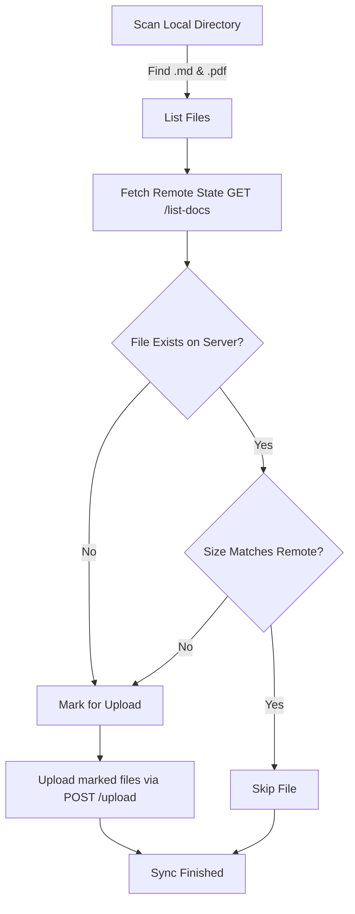

# CLI User Guide

`raglike-cli` is a high-performance terminal utility built to synchronize your local folders of Markdown files and PDF documents with your running `raglike-md` instance.

---

## 🚀 Installation & Invocation

### 1. Zero-Install (On-demand execution)
If you are in the project root, you can run the CLI directly using Bun:
```bash
bun x ./cli <directory-to-sync>
```

### 2. Global Installation
To install the tool globally so that it is available system-wide:
```bash
bun run install-cli
```
This builds and installs `raglike-cli` to your global Bun binary path.

---

## ⚙️ Configuration & Precedence

To avoid typing the server URL and API tokens on every sync command, you can use persistent configuration files.

### Configuration File (`.raglike`)
Create a `.raglike` JSON file in either:
1.  **Current Working Directory**: `./.raglike` (Project-specific)
2.  **Home Directory**: `~/.raglike` (Global fallback)

```json
{
  "server": "http://localhost:4321",
  "token": "your_secure_api_token"
}
```

### Resolution Order
The CLI resolves configuration parameters in the following order:
1.  **Command Line Flags** (e.g. `--server` or `--token` passed explicitly).
2.  **Local Configuration**: `./.raglike` in the current working directory.
3.  **Global Configuration**: `~/.raglike` in your home directory.

---

## 📖 Usage Reference

```bash
raglike-cli <path-to-folder> [options]
```

### Parameters & Options:
*   `<path-to-folder>`: Relative or absolute path to the directory containing documents to sync.
*   `-s, --server <url>`: The target `raglike-md` HTTP server URL (overrides config).
*   `-t, --token <token>`: Bearer authorization token (overrides config).
*   `-h, --help`: Displays CLI help details.

### Syncing Examples:
```bash
# Sync current directory using defaults or .raglike file
raglike-cli .

# Sync specific directory to a custom server
raglike-cli ./notes -s http://192.168.1.100:4321 -t my_secret_token
```

---

## 🔄 How Syncing Works (Delta Sync)

To optimize network performance and keep indexing times low, the CLI performs a **Delta Sync** instead of bulk-uploading all files:



1.  **Discovery**: Recursively scans the target directory, discovering all files ending with `.md` or `.pdf`.
2.  **State Retrieval**: Queries the remote `raglike-md` server via `GET /list-docs` to retrieve metadata (file path, last modified date, and size) of all currently indexed documents.
3.  **Delta Calculation**: Compares each local file against the remote list:
    *   If a file does not exist on the server, it is queued for upload.
    *   If a file exists but its local file size differs from the remote file size, it is queued for upload.
    *   Otherwise, it is skipped.
4.  **Upload & Ingest**: Transmits all queued files in parallel using `multipart/form-data` to the `/upload` endpoint. The server indexes them immediately.
