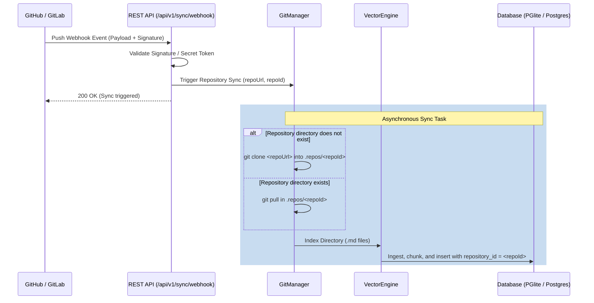

# Git Webhooks Setup Guide

`raglike-md` supports automatic, zero-UI index synchronization via push webhooks from GitHub and GitLab. When code is pushed, the server pulls the latest changes, splits modified files, and updates the database.

---

## 🔒 Security Configuration

To enable webhook endpoints, you **must** configure a `WEBHOOK_SECRET` environment variable on your `raglike-md` instance:

*   **GitHub**: The server validates payloads using **HMAC-SHA256** signature verification using the secret.
*   **GitLab**: The server validates payloads by comparing the header token directly against the secret.

---

## 🐙 1. GitHub Integration

### Step-by-Step Setup:
1.  Go to your repository settings on GitHub.
2.  Navigate to **Settings** > **Webhooks** > **Add webhook**.
3.  **Payload URL**: `http://<your-server-ip>:4321/api/v1/sync/webhook`
4.  **Content type**: `application/json`
5.  **Secret**: Enter the exact string set in your `WEBHOOK_SECRET` env variable.
6.  **Which events would you like to trigger this webhook?**: Choose **Just the push event**.
7.  Click **Add webhook**.

GitHub will send a ping event to test connectivity. The server should respond with `400` ("Unsupported event") but show signature validation passed in the logs.

---

## 🦊 2. GitLab Integration

### Step-by-Step Setup:
1.  Navigate to your GitLab project settings.
2.  Select **Settings** > **Webhooks**.
3.  **URL**: `http://<your-server-ip>:4321/api/v1/sync/webhook`
4.  **Secret token**: Enter the exact string set in your `WEBHOOK_SECRET` env variable.
5.  **Trigger**: Select **Push events**.
6.  Click **Add webhook**.

---

## ⚙️ How Synchronization Works

1.  **Incoming Push Payload**: The server processes Git webhook event payloads. It parses out the repository clone URL (`clone_url` or `git_http_url`) and maps the repository name into a unique path-safe string (e.g., `owner-name` instead of `owner/name`).
2.  **Git Manager Integration**:
    *   If the repository has never been indexed before, `GitManager` clones it into the `.repos/<repository_id>` subdirectory.
    *   If it is already present, it navigates into the folder and executes `git pull`.
3.  **Re-indexing & Tagging**:
    *   The engine scans the repository for all `.md` files.
    *   It chunks the files, generates embeddings, and inserts them into the database.
    *   **Crucial Step**: Each record is tagged with the `repository_id` column.
4.  **Scoping Queries**: Once indexed, you can restrict semantic searches to this specific repository using the `repository` argument in the search endpoints/tools.
