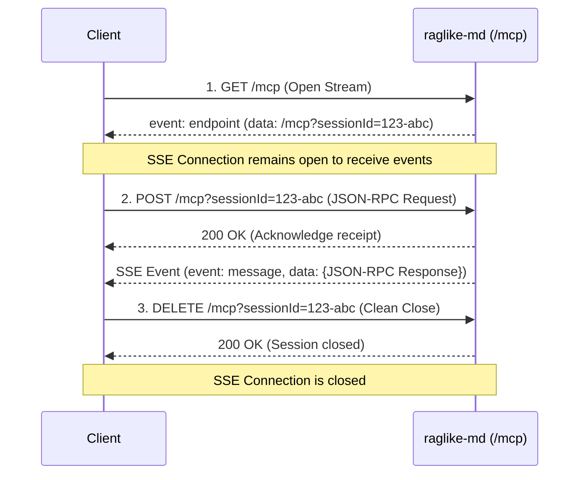

# MCP over HTTP (SSE) Stream Protocol

`raglike-md` supports the Model Context Protocol (MCP) using Server-Sent Events (SSE) as the transport layer. This allows stateful, bi-directional communication between the search engine and remote AI tools.

---

## 🔄 Stateful SSE Lifecycle

The connection follows a strict lifecycle over three operations:



---

## 📖 Endpoint References

### 1. Establish connection: `GET /mcp`
Initiates a Server-Sent Events stream connection. The server assigns a unique session ID and transmits it as the first message event.

*   **Request**:
    ```bash
    curl -N http://localhost:4321/mcp
    ```
*   **Response Stream**:
    ```text
    event: endpoint
    data: /mcp?sessionId=73a3c98d-6916-4b82-8929-798418043644
    ```

> [!IMPORTANT]
> The client must parse the `sessionId` from this URL. All subsequent `POST` and `DELETE` requests **must** pass this ID as a query parameter (`?sessionId=...`) to route messages correctly.

---

### 2. Send JSON-RPC Requests: `POST /mcp`
Flashes messages to the active session. All responses to these requests are sent as `event: message` payloads on the *original* open SSE stream, not in the HTTP POST response.

#### Example 1: List Tools
*   **POST Request**:
    ```bash
    curl -X POST "http://localhost:4321/mcp?sessionId=73a3c98d-6916-4b82-8929-798418043644" \
         -H "Content-Type: application/json" \
         -d '{
           "jsonrpc": "2.0",
           "id": 1,
           "method": "tools/list",
           "params": {}
         }'
    ```
*   **Response on open SSE stream**:
    ```text
    event: message
    data: {"jsonrpc":"2.0","id":1,"result":{"tools":[{"name":"semantic_markdown_search",...}]}}
    ```

#### Example 2: Call Semantic Search Tool
*   **POST Request**:
    ```bash
    curl -X POST "http://localhost:4321/mcp?sessionId=73a3c98d-6916-4b82-8929-798418043644" \
         -H "Content-Type: application/json" \
         -d '{
           "jsonrpc": "2.0",
           "id": 2,
           "method": "tools/call",
           "params": {
             "name": "semantic_markdown_search",
             "arguments": {
               "query": "architecture overview",
               "limit": 1
             }
           }
         }'
    ```
*   **Response on open SSE stream**:
    ```text
    event: message
    data: {"jsonrpc":"2.0","id":2,"result":{"content":[{"type":"text","text":"### ID: [24] File: `docs/architecture/overview.md`..."}]}}
    ```

---

### 3. Terminate Connection: `DELETE /mcp`
Cleanly closes the session context on the server, freeing resources.

*   **Request**:
    ```bash
    curl -X DELETE "http://localhost:4321/mcp?sessionId=73a3c98d-6916-4b82-8929-798418043644"
    ```
*   **Response**: `200 OK`

---

## 🛠️ TypeScript Client Implementation

If you are writing a custom Node/TypeScript client, use the `@modelcontextprotocol/sdk` to manage this lifecycle automatically:

```typescript
import { Client } from "@modelcontextprotocol/sdk/client/index.js";
import { SSEClientTransport } from "@modelcontextprotocol/sdk/client/sse.js";

// 1. Instantiate SSE transport
const transport = new SSEClientTransport(new URL("http://localhost:4321/mcp"));

// 2. Initialize Client
const client = new Client(
  { name: "custom-agent-client", version: "1.0.0" },
  { capabilities: {} }
);

// 3. Connect (handles GET /mcp connection and sets up POST/DELETE routes)
await client.connect(transport);

// 4. Query tools transparently
const tools = await client.listTools();
console.log("Available tools:", tools);

const searchResult = await client.callTool({
  name: "semantic_markdown_search",
  arguments: { query: "Docker container guides", limit: 2 }
});
console.log("Search results:", searchResult);
```
